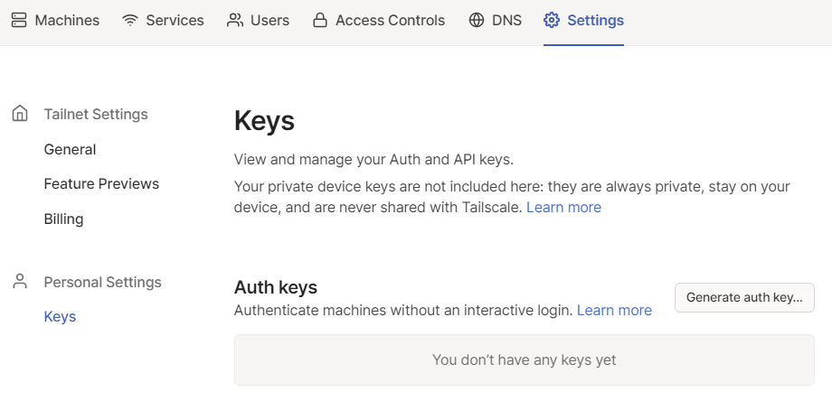
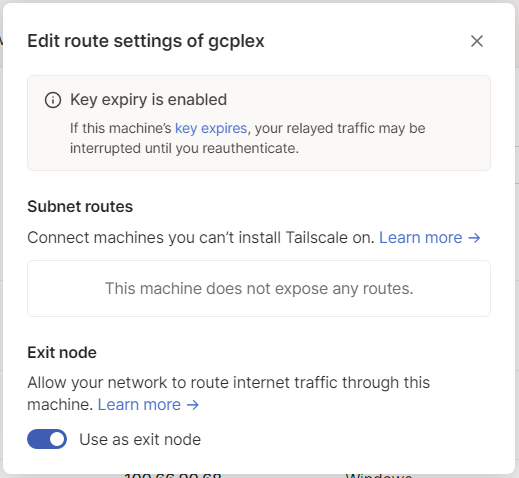

# 도커 컨테이너로 tailscale 구동하기
 

## 1. docker-compose.yml

```
cat << EOF > docker-compose.yml
version: "2.4"
services:
  tailscale:
    image: tailscale/tailscale:latest
    container_name: tailscale
    hostname: tailscale
    restart: unless-stopped
    privileged: true
    environment:
      - TZ=Asia/Seoul
    volumes:
      - /dev/net/tun:/dev/net/tun
      - /opt/appdata/tailscale/var_lib:/var/lib
      - /var/run/dbus/system_bus_socket:/var/run/dbus/system_bus_socket
      - ./data:/root
    cap_add:
      - net_admin
      - sys_module
    command: tailscaled

networks:
  default:
    name: my_bridge
    driver: bridge
EOF

```

## 2. tailscale docker-compose up

```
docker-compose up -d

```

## 3. enable ip forwarding

```
echo 'net.ipv4.ip_forward = 1' | sudo tee -a /etc/sysctl.conf
echo 'net.ipv6.conf.all.forwarding = 1' | sudo tee -a /etc/sysctl.conf
sudo sysctl -p /etc/sysctl.conf

```

## 4. login use authkey

tailscale admin page: https://login.tailscale.com/admin



Settings > Personal Settings > Keys > Auth keys > Generate auth key... > copy

```
docker exec -it tailscale tailscale up --authkey=tskey-kFYpHy2CNTRL~~~~~~~
```

## 5. enable exit node & Tailscale SSH

network_mode = host 로 설정하면 exit node 가 정상적으로 동작하지 않는다.

```
docker exec -it tailscale tailscale up --ssh --accept-routes --advertise-exit-node

```

tailscale admin page : https://login.tailscale.com/admin



... click > Edit route settings... > Exit node > enable : Use as exit node

## 6. connect docker container

```
docker exec -it tailscale /bin/sh

```

## 7. Tailscale SSH 사용 팁

docker-compose.yml 파일이 있는 폴더에서 다음과 같이 작성한다.

- data 디렉토리를 생성한다. tailscale 도커 이미지에서 /root 에 마운트된다

```
mkdir data

```

- .aliases 파일을 만든다. 자기가 자주 사용하는 alias를 적어두면 된다.
- hostos는 tailscale 도커 컨테이너에서 호스트 OS로 접속하는 alias 이다.
- 호스트 OS에 접속하는 계정은 ubuntu로 하였으니 사용하는 계정으로 변경하여 사용하면 된다.

> data/.aliases

```
cat << EOF > data/.aliases
alias ls='ls --color=auto -CF'
alias la='ls -A'
alias ll='ls -alF'
alias lt='ls -ltr'
alias grepi="egrep -v '^[[:space:]]*([#\;].*)?$'"
alias mtr="mtr -i 1 -G 1 -Z 1 -b -w"
alias myip='curl http://checkip.amazonaws.com'
alias so='source ~/.aliases'
GW=\`route -n | grep ^0.0.0.0 | awk '{print \$2}'\`
alias hostos='ssh ubuntu@\$GW'
EOF

```

- .profile 파일을 만든다. 로그인 시 자동 실행된다.
- .aliases 파일을 읽어들이고, ssh client 파일을 설치한다.
- 호스트 OS에 접속하는 방법을 알려준다.

$ vi data/.profile

```
cat << EOF > data/.profile
source ~/.aliases
apk add -q openssh-client-default curl
echo '------------------'
echo 'To connect HostOS,'
echo 'Check alias hostos'
echo '------------------'
echo \$GW=$GW
alias hostos
EOF

```

- 호스트 OS에 SSH로 접속하기 위한 RSA 키를 호스트 OS에서 복사한다.
- 호스트 OS 계정의 authorized_key에 호스트 OS 계정의 id_rsa.pub 키를 등록한다.
- 만약 호스트 OS 계정에 id_rsa 키가 없으면 아래 명령어로 생성한다.
- ssh-keygen -t rsa

```
mkdir data/.ssh
chmod 700 data/.ssh
cp ~ubuntu/.ssh/id_rsa data/.ssh/id_rsa
cat ~ubuntu/.ssh/id_rsa.pub >> ~ubuntu/.ssh/authorized_keys
```

## 8. Access List 설정

```json
{
 "acls": [
  {
   "action": "accept",
   "src":    ["autogroup:members"],
   "dst":    ["autogroup:members:*"]
  },
  {
   "action": "accept",
   "src": ["autogroup:members"],
   "dst": ["autogroup:internet:*"]
  }
 ]
}
```
